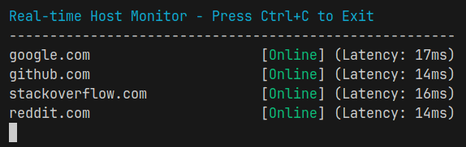

# Ping Tracker



A concurrent network scanning tool that pings IP addresses or hostnames and displays their status in real-time.

## Prerequisites

- Go 1.16 or higher
- Git
- Linux Users: Sadly this application requires privileged access to send ICMP ping requests using raw sockets. You can run the application with elevated privileges or grant the necessary capabilities to the binary.

## Installation

1. Clone the repository:
```bash
git clone https://github.com/kvn-alcantara/ping-tracker.git
cd ping-tracker
```

2. Install dependencies:
```bash
go mod download
```

3. Build the application:
```bash
go build ./cmd/pingtracker
```

4. Run as Root (Linux only):
```bash
sudo ./ping-tracker
```

## Usage

### Basic Usage

To scan a range of IP addresses:
```bash
./pingtracker -range 192.168.1.1-192.168.1.255
```

To scan a list of hostnames:
```bash
./pingtracker -hosts example.com,google.com,github.com
```

### Command Line Options

- `-range`: Specify an IP range (e.g., 192.168.1.1-192.168.1.255)
- `-hosts`: Specify a comma-separated list of hostnames

## Testing

Run the test suite:
```bash
go test ./...
```

Run tests with coverage:
```bash
go test -cover ./...
```
